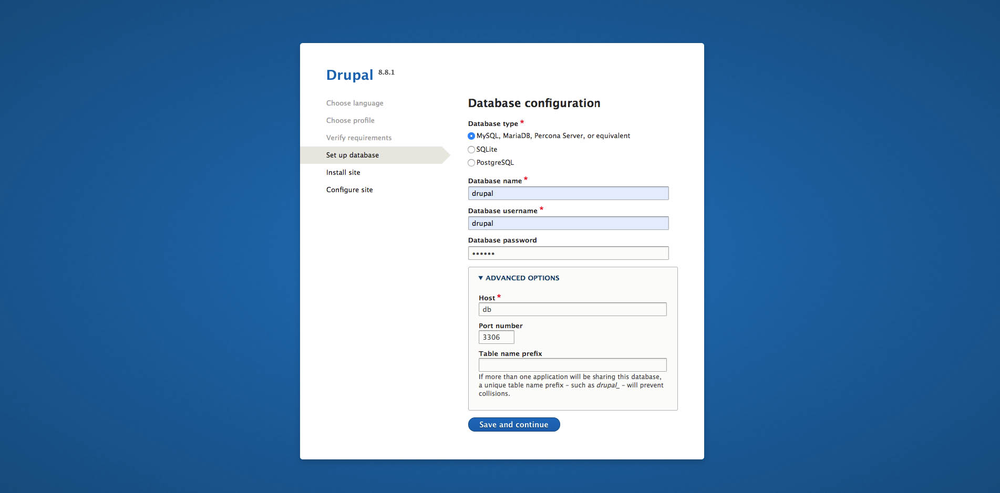
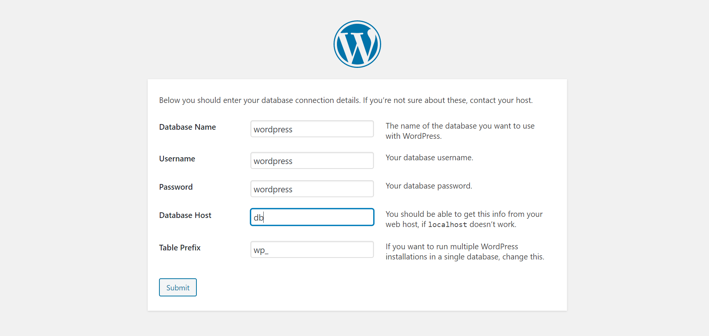

# One command drupal/wordpress

One command to create a drupal or wordpress workflow. 

With one command you will have the files, the containers for the server, the site up and running along with phpmyadmin.

# Requirements
- php
- composer (for drupal only)
- git
- wget
- tar (for wordpress only)
- docker
- command line 

# Installation (only once)
1. First download the phar file that has the application
```
wget https://github.com/georgetour/One-command-Drupal-Wordpress/raw/master/app/ocd.phar
```

2. Move the application so you can run it and change permissions
```
sudo mv ocd.phar /usr/local/bin/ocd
sudo chmod 755 /usr/local/bin/ocd
```

3. Create an external nginx reverse proxy that will handle the domains locally.
```
docker network create nginx-proxy
```

```
git clone https://github.com/georgetour/nginx-proxy.git
```
Inside the folder:
```
docker-compose up -d
```

# One command
### For drupal-project
```
ocd create drupal-project myproject 
```

### For wordpress-project 
```
ocd create wordpress-project myproject
```

You just say ocd create then parameter drupal-project/wordpress-project projectname (gives containers names also).

## That's it!

# View and run your site

After the containers have been created, you just have to run docker-composer start in your project's folder, whenever you want to access your project.

### Don't forget to add your site at hosts file. If your site is myproject.dd add in your hosts: 
- 127.0.0.1 myproject.dd pma.myproject.dd

## View your new site local
http://myproject.dd

## View phpMyAdmin 
http://pma.myproject.dd


## Creds
### For drupal and phpMyAdmin
- database name: drupal
- database username: drupal
- password: drupal
- user root: root
- root password: password
- host: db



### For wordpress and phpMyAdmin 
- database name: wordpress
- database username: wordpress
- password: wordpress
- user root: root
- root password: password
- host: db



# Repositories used

#### The docker for the server used is from here
https://github.com/georgetour/lemp-docker


#### The docker for reverse proxy so we can have the domain names
https://github.com/georgetour/nginx-proxy

## Known issues 
*Sometimes when using wsl2 with windows 10 if you create a new project, even if docker and all it's containers are running we have a 503 nginx error. With restart you can run docker-compose start and it will run normally. This probably has something to do with the connection between wsl2, windows, docker and the containers.*

In the latest update of docker those issues seem to be fixed:

https://docs.docker.com/docker-for-windows/release-notes/#bug-fixes-and-minor-changes


