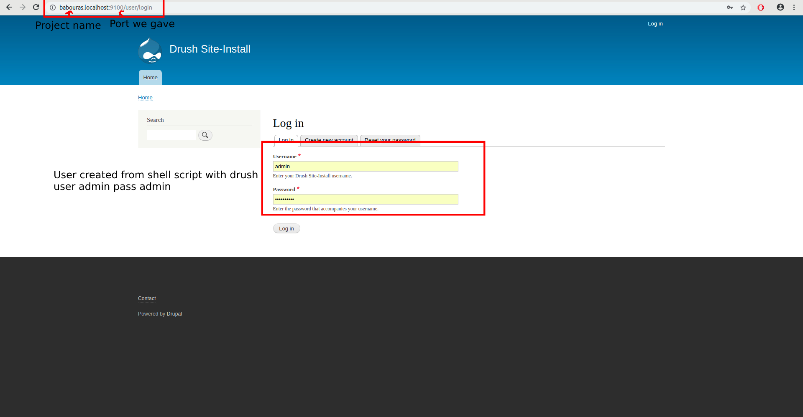

# Automatic workflow for creating a drupal or wordpress project with docker.

#### This is a workflow that will help you create a drupal or wordpress project with docker up and running.

Technologies used:

Command line tools from Symfony framework

PHP

Composer

Docker with official images mariadb, drupal, phpmyadmin, traefik 

Shell

Later will add gulp and sass...

This is only tested in <strong>Linux</strong> but probably it will work in windows with wsl and mac.

## Requirements

Docker (install docker for your machine)

PHP (php must be installed also)

Composer

```
wget https://getcomposer.org/download/1.6.5/composer.phar
mv composer.phar /usr/local/bin/composer
chmod 755 /usr/local/bin/composer
```

## How to create a project

1. git clone or download the repository directly from https://github.com/georgetour/dw-docker

2. Open command line and go to folder php-app so we will be in dw-docker/php-app

3. Run 
```
./dwstart.php create drupal-project project-name port
```

We are using the script dwstart.php as shell script and the command create takes three arguments. First if it will be a drupal-project or wordpress-project. Second the project name which will create the folder and all realted to this like url etc. Third argument the port the containers will run on. I usually use 9100+ which are empty.

4. Wait some minutes and you will see containers are created. Until I make a loading or something for the comamnd line you will have to wait some minutes where it says Creating project_app done ..........

5. Check the project at project-name.localhost:port

6. Phpmyadmin will be in pma.project-name.localhost:port

7. Your projects will be in projects folder

8. We are using drush to add credentials which will be user admin password admin



9. To start containers for a project enter the project-name folder
```
docker-compose start 
```

10. To stop containers for a project enter the project-name folder
```
docker-compose stop
```

11. Enjoy!

### Drupal commands examples

#### 1. How to use drush?

First enter our app container.

```
docker exec -it project-name_app bash
```

You will be in /app folder as root

```
root@3fee477ce768:/app# 
```

Enable and add a module 
```
drush en pathauto -y
```

#### 2. How to export database?

Enter our mariadb container.

```
docker exec -it project-name_db bash
```

We will be again as root in mariadb container.
```
root@e1dc102dc10b:~# 
```

Access the backups folder since it is volumed in our docker-compose.yml file.
```
cd backups
```

Run mysqldump with correct credentials(be carefull the host) and take your mysql file in your project's folder.
```
mysqldump -u root -p -h projet-name_db drupal > filename.sql
```

#### 3. Using composer

If you want to use a <strong>custom</strong> composer project go to Drupal folder in shell.sh and check:
```
#Access container app and run composer 
```


#### TODO
Add custom composer file and empty drupal theme
 
Add gulp and SASS

Add wordpress containers

Make it a phar so we can avoid the strange ./dwstart.php syntax


