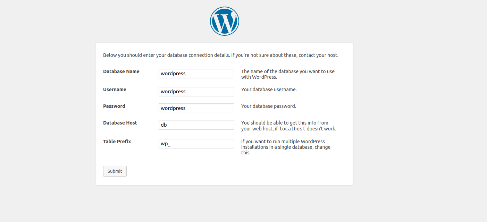
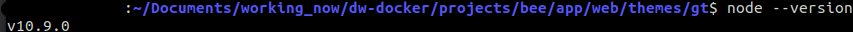
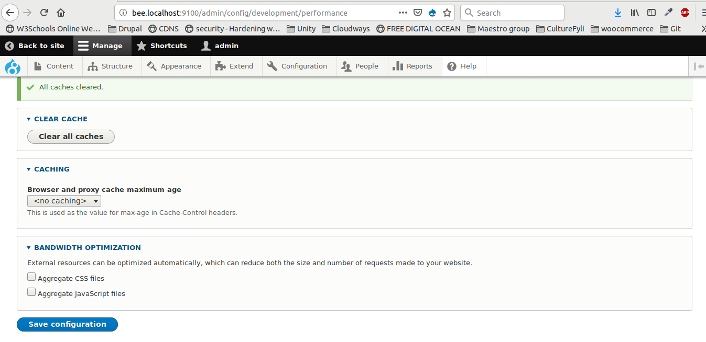

# Automatic workflow for creating a drupal or wordpress project with docker.

#### This is a workflow that will help you create a drupal or wordpress project with docker up and running.

> <strong>The idea is to be simple and use only one command.</strong>

<hr>

#### Technologies used:

Command line tools from Symfony framework

PHP

Composer

Docker with official images mariadb, drupal, phpmyadmin, traefik 

Shell

Gulp and SASS(for drupal only)

This is only tested in <strong>Linux</strong> and <strong>Mac</strong> but 99% will work with windows and WSL. 

<hr>

## Requirements

Docker (install docker for your machine)

PHP (php must be installed also)

Composer(for drupal only)

```
wget https://getcomposer.org/download/1.6.5/composer.phar
mv composer.phar /usr/local/bin/composer
chmod 755 /usr/local/bin/composer
```
<hr>

## How to create a project

1. git clone or download the repository directly from https://github.com/georgetour/dw-docker

2. Edit shell.sh file in Drupal and Wordpress folder and change user

3. Open command line and go to folder php-app so we will be in dw-docker/php-app. Make an alias for our php
execute script:

```
alias dw='./dwstart.php'
```

In our php-app folder just give your project name and port for docker...

#### To create a drupal project run:
```
dw create drupal-project project-name port
```

#### To create a wordpress project run:
```
dw create wordpress-project project-name port
```

##  ***** 
##  That's it!
##  *****

How command works/help:
```
dw create --help
```

<hr>

### Access project and project files

1. Check the project at project-name.localhost:port

2. Phpmyadmin will be in pma.project-name.localhost:port

3. Your projects will be in projects folder

4. We are using drush to add credentials which will be user admin password admin(drupal only)

<hr>

### Wordpress creds for first steps
These are created by the .env file in Wordpress folder.


<hr>

### Drupal commands examples

#### 1. How to use drush?

First enter our app container.

```
docker exec -it project-name_app bash
```

You will be in /app folder as root

```
root@3fee477ce768:/app# 
```

Enable and add a module 
```
drush en pathauto -y
```

#### 2. How to export database?

Enter our mariadb container.

```
docker exec -it project-name_db bash
```

We will be again as root in mariadb container.
```
root@e1dc102dc10b:~# 
```

Access the backups folder since it is volumed in our docker-compose.yml file.
```
cd backups
```

Run mysqldump with correct credentials(be carefull the host) and take your mysql file in your project's folder.
```
mysqldump -u root -p -h projet-name_db drupal > filename.sql
```

#### 4. Enable gt blank theme that will be used with Gulp and SASS

```
drush theme:enable gt && drush config-set system.theme default gt
```

#### 3. Using composer

If you want to use a <strong>custom</strong> composer project go to Drupal folder in shell.sh and check:
```
#Access container app and run composer 
```

<hr>

## Using Gulp and SASS(only for drupal)

1. Check for node 
```
node --version
```


2. Install gulp line utility
```
npm install --global gulp-cli
```

3. Go to where the gulpfile.js is located and install gulp specific version locally
```
npm install gulp@3.8.11 
```

4. Run gulp at the projectname/app/web/themes/gt
```
gulp
```
It will create a package.json file and search for modules needed like gulp-sass

5. Add rest modules needed
```
npm install gulp-sass gulp-autoprefixer gulp-sourcemaps gulp-autoprefixer gulp-clean-css gulp-brwsersync --save-dev
```

6. Disable aggregation so you don't have problem with caching and browsersync


6. Your site will start at localhost:3000 and will be synced with browsersync that checks changes in sass folder.

> If you have problem with watcher error in linux 
```
echo fs.inotify.max_user_watches=524288 | sudo tee -a /etc/sysctl.conf && sudo sysctl -p
```

<hr>

#### General commands

1. To start containers for a project enter the project-name folder
```
docker-compose start 
```

2. To stop containers for a project enter the project-name folder
```
docker-compose stop
```

> <strong>If you need to create a new project, you have to stop containers that were created with this workflow, since they won't be created correctly. To do this, go to project folder that is running and run docker-compose stop.</strong>

>><strong>Also be carefull not to have the same network used again for docker. For example if you create a drupal project called bee, you will have a bee_default network along with the containers. If you delete the containers for some reason, you must also remove your associated network:</strong>

```
docker network prune
```

## Enjoy!

<hr>

#### TODO
Volume apache to see logs maybe


