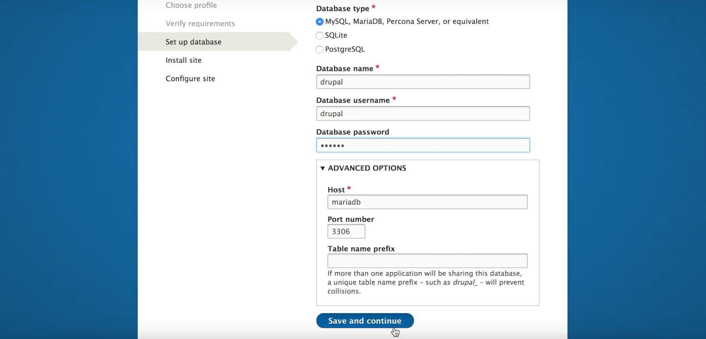

# Automatic workflow for creating drupal project with composer and docker

This project will help you create a drupal environment. It is based in https://github.com/drupal-composer/drupal-project but will have useful modules generally used in Drupal sites. Also we will use docker for the environment so you can run your site locally.

The current installation is for linux. Probably it will work in WSL and Mac with some changes.


## Usage

First you need to understand what composer is:

1. Composer is a Dependency Manager for php like npm for node etc.

2. Composer is used by drupal core.

3. All modules may be downloaded using it.

4. Some modules and libraries require it like commerce.

You will be amazed how many stuff you can do with it from the command line!

### Step 1 Install composer
```
wget https://getcomposer.org/download/1.6.5/composer.phar
mv composer.phar /usr/local/bin/composer
chmod 755 /usr/local/bin/composer
```

### Step 2 Create drupal project
This will create drupal folders will all files in public_html folder that was referenced in composer.json.

```
composer create-project georgetour/drupal-composer-docker-workflow some-dir --stability dev --no-interaction
```

### Step 3 Download docker-compose file
This will have images for the server that will run our drupal site. It will contain nginx, mariadb, phpmyadmin. You can download it with wget or from github directly https://github.com/georgetour/drupal-composer-docker-workflow .

```
wget https://raw.githubusercontent.com/georgetour/drupal-composer-docker-workflow/master/docker-compose.yml
```

### Step 4 Download .env file and change variables
In our .env file we have variables like your local's site name, db name, passwords etc... You can download it directly
with wget or check the repo and the example and make changes.

```
wget https://raw.githubusercontent.com/georgetour/drupal-composer-docker-workflow/master/.env
```
## Step 5 Run docker-compose up
In the folder that we have our public_html that was created from composer, and after you have copied there docker-compose.yml and .env in the command line, write:

```
docker-compose up
```

## Step 6 Test your site locally and config/sync problem
You can now type in your browser the url for your project. You will
see we have a drupal fresh installation.



Choose profile and if your requirements are ok, you will pass the info we have in .env file.

In linux I had to create manually the config/sync file and add user to it.

```
mkdir config && mkdir config/sync
chown yourname config -R
```

You are ready!

#### ***TODO***

1. Automate creation of config/syng folder and add user to it
2. Bypass drupal fresh install screen and have inserted all the info so it will run directly
3. Enable modules
4. Make the commands simpler with custom script and all to one
5. Have empty theme installed
6. Add gulp and sass files
